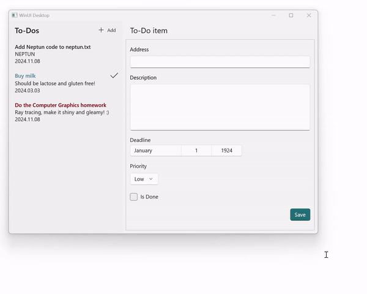
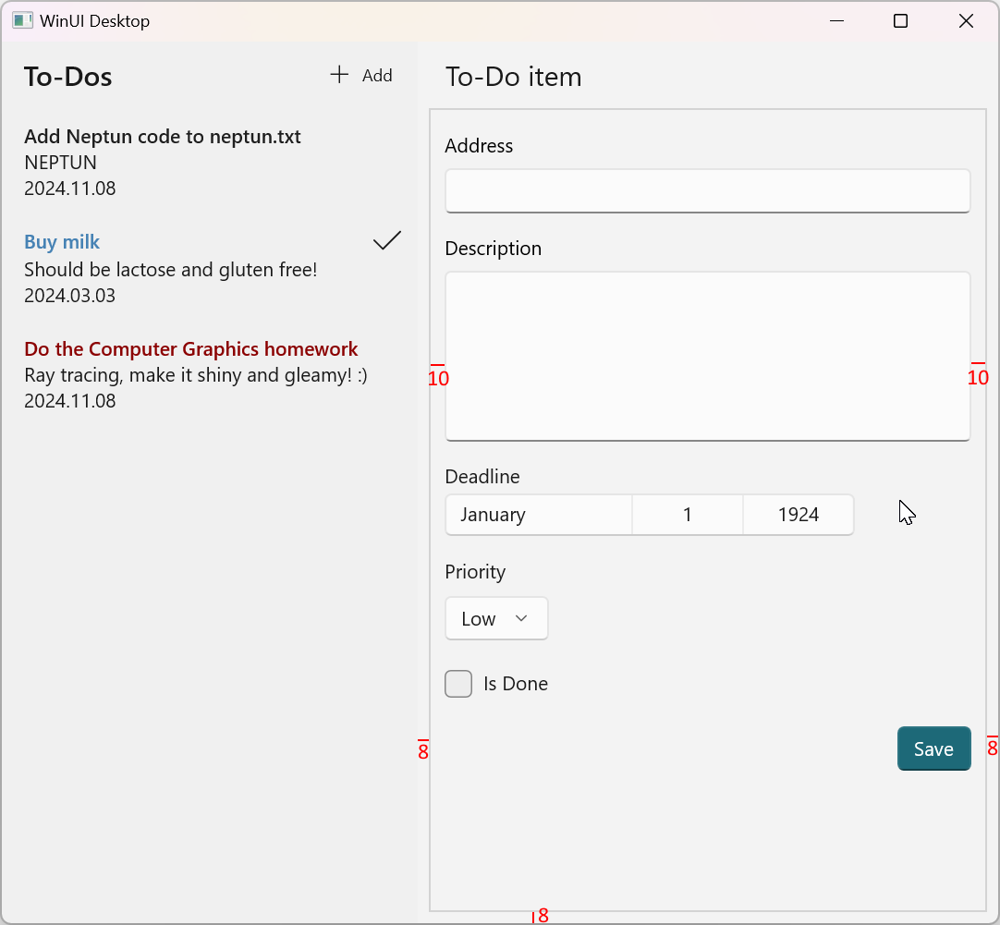
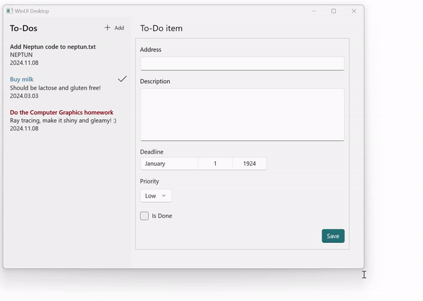

# 3. HF - Felhasználói felület kialakítása

## Bevezetés

A házi feladatban elkészítendő kis szoftver egy egyszerű feladatkezelő alkalmazás, amelyben a felhasználók feladatokat tudnak listázni létrehozni, módosítani.

Az önálló feladat a XAML előadásokon elhangzottakra épít. A feladatok gyakorlati hátteréül a [3. labor – Felhasználói felületek kialakítása](../../labor/3-felhasznaloi-felulet/index.md) laborgyakorlat szolgál.

A fentiekre építve, jelen önálló gyakorlat feladatai a feladatleírást követő rövidebb iránymutatás segítségével (néha alapértelmezetten összecsukva) önállóan elvégezhetők.

Az önálló gyakorlat célja:

- XAML felületleíró nyelv használatának gyakorlása
- Alapvető vezérlők (táblázat, gomb, szövegdoboz, listák) használatának gyakorlása
- Felületi interakciók kezelése eseményvezérelten
- Adatok megjelenítése a felületen adatkötéssel

A szükséges fejlesztőkörnyezetről [itt](../fejlesztokornyezet/index.md) található leírás.

!!! warning "Fejlesztőkörnyezet WinUI3 fejlesztéshez"
    A korábbi laborokhoz képest plusz komponensek telepítése szükséges. A [fenti](../fejlesztokornyezet/index.md) oldal említi, hogy szükség van a ".NET desktop development" Visual Studio Workload telepítésére, valamint ugyanitt az oldal alján van egy "WinUI támogatás" fejezet, az itt megadott lépéseket is mindenképpen meg kell tenni!

## A beadás menete

:exclamation: [Bár az alapok hasonlók](../hf-folyamat/index.md), vannak lényeges, a folyamatra és követelményekre vonatkozó eltérések a korábbi házi feladatokhoz képest, így mindenképpen figyelmesen olvasd el a következőket.

- Az alapfolyamat megegyezik a korábbiakkal. GitHub Classroom segítségével hozz létre magadnak egy repository-t. A meghívó URL-t Moodle-ben találod (a tárgy nyitóoldalán a "*GitHub classroom hivatkozások a házi feladatokhoz*" hivatkozásra kattintva megjelenő oldalon látható). Fontos, hogy a megfelelő, ezen házi feladathoz tartozó meghívó URL-t használd (minden házi feladathoz más URL tartozik). Klónozd le az így elkészült repository-t. Ez tartalmazni fogja a megoldás elvárt szerkezetét. A feladatok elkészítése után commit-old és push-old a megoldásod.
- A kiklónozott fájlok között a `TodoXaml.sln`-t megnyitva kell dolgozni.
- :exclamation: A feladatok kérik, hogy készíts **képernyőképet** a megoldás egy-egy részéről, mert ezzel bizonyítod, hogy a megoldásod saját magad készítetted. **A képernyőképek elvárt tartalmát a feladat minden esetben pontosan megnevezi.**
A képernyőképeket a megoldás részeként kell beadni, a repository-d gyökérmappájába tedd (a neptun.txt mellé).
A képernyőképek így felkerülnek GitHub-ra a git repository tartalmával együtt.
Mivel a repository privát, azt az oktatókon kívül más nem látja.
Amennyiben olyan tartalom kerül a képernyőképre, amit nem szeretnél feltölteni, kitakarhatod a képről.
- :exclamation: Ehhez a feladathoz érdemi előellenőrző nem tartozik: minden push után lefut ugyan, de csak a neptun.txt kitöltöttségét ellenőrzi. Az érdemi ellenőrzést a határidő lejárta után a laborvezetők teszik majd meg.

## Kikötések

:warning: __MVVM minta - ne alkalmazd!__  
  Jelen házi feladatban az MVVM mintát még NE használd (egyik későbbi részfeladatnál sem), `ViewModel` osztályt NE vezess be. Az MVVM egy később házi feladatnak lesz a tárgya.

:warning: __Layout - egyszerűség__  
Mint általában, a jelen házi feladat keretében elkészítendő feladatra is igaz, hogy az oldal alapelrendezését `Grid`-del célszerű kialakítani. Ugyanakkor az egyes belső részek elrendezésének kialakításakor törekedj az egyszerűségre: ahol az `StackPanel`-t is lehet használni, ne használj `Grid`-et.

## 1. feladat - Modell kialakítása és tesztadatok

A projekten belül hozzunk létre egy `Models` mappát (VS Solution Exporerben), majd a mappába az alábbi ábrán látható osztályt és enum típust. A `TodoItem` osztály fogja tartalmazni a teendők adatait, a prioritáshoz egy felsorolt típust hozunk létre.

<figure markdown>

</figure>

Mindkét típus legyen publikus (írjuk a `class` és az `enum` elé a `public` kulcsszót), különben "Inconsistent accessibility" hibát kapnánk a későbbiekben a fordítás során.

A `MainPage` oldal fogja a teendők listáját megjeleníteni. Most memóriában lévő tesztadatokat használjunk, melyeket a `View` mappában található `MainPage.xaml.cs`-ben hozzunk létre: itt `Todos` néven vezessünk be egy `List<TodoItem>` tulajdonságot (melyet később a felületen elhelyezett `ListView` vezérlőhöz kötünk adatkötéssel). Ez a lista `TodoItem` objektumokat tartalmaz.

```csharp title="MainPage.xaml.cs"
public List<TodoItem> Todos { get; set; } = new()
{
    new TodoItem()
    {
        Id = 3,
        Title = "Add Neptun code to neptun.txt",
        Description = "NEPTUN",
        Priority = Priority.Normal,
        IsDone = false,
        Deadline = new DateTime(2024, 11, 08)
    },
    new TodoItem()
    {
        Id = 1,
        Title = "Buy milk",
        Description = "Should be lactose and gluten free!",
        Priority = Priority.Low,
        IsDone = true,
        Deadline = DateTimeOffset.Now + TimeSpan.FromDays(1)
    },
    new TodoItem()
    {
        Id = 2,
        Title = "Do the Computer Graphics homework",
        Description = "Ray tracing, make it shiny and gleamy! :)",
        Priority = Priority.High,
        IsDone = false,
        Deadline = new DateTime(2024, 11, 08)
    },
};
```

??? note "A fenti kód magyarázata"
    A fenti kódrészletben több modern C# nyelvi elemet kombináltunk:

    * Ez egy auto-implementált tulajdonság (lásd 2. labor).
    * Kedzőértéket adtunk neki.
    * A `new` után nem adtuk meg a típust, mert a fordító ki tudja következtetni (lásd 2. labor "Target-typed new expressions").
    * A gyűjtemény elemeit `{}` között soroljuk fel (lásd 2. labor "Collection initializer szintaxis").

!!! note "`MainPage` osztály"
    A házi feladat során a beépített `Page` osztályból származó `MainPage` osztályban dolgozunk. A `Page` osztály az ablakon belüli oldalak közötti navigációt segíti. Bár jelen feladatban ezt nem használjuk ki, érdemes megszokni a használatát. Mivel alkalmazásunk egyetlen oldalból áll, a főablakban egyszerűen csak példányosítunk egy `MainPage` objektumot (érdemes a `MainWindow.xaml` fájlban ezt megtekinteni).

## 2. feladat - Oldal elrendezése (layout), lista megjelenítése

### Layout

A `MainPage.xaml`-ben hozzuk létre a felületet, amelyen a teendők listáját megjelenítjük.

<figure markdown>

<figurecaption>Készítendő alkalmazás listázó felülettel</figurecaption>
</figure>

Mint a fenti ábra a három teendővel mutatja, a teendők adatait egymás alatt kell megjeleníteni, a teendők prioritását színek jelzik, a kész teendők mellett azok jobb oldalán egy pipa jelenik meg.

A felületen a következő struktúrában helyezkednek el az elemek:

* A `MainPage`-en belül egy `Grid`-et használjunk, amelyben két sorban és két oszlopban helyezkednek el az elemek. Az első oszlop fix széles legyen (pl.: 300 px), a második pedig a maradék helyet foglalja el.
* Az első oszlop első sorában egy `CommandBar` vezérlő kerüljön, melyben egy cím és egy gomb helyezkedik el. Ehhez az alábbi példa szolgál segítségül:

    ```xml
    <CommandBar VerticalContentAlignment="Center"
                Background="{ThemeResource AppBarBackgroundThemeBrush}"
                DefaultLabelPosition="Right">
        <CommandBar.Content>
            <TextBlock Margin="12,0,0,0"
                       Style="{ThemeResource SubtitleTextBlockStyle}"
                       Text="To-Dos" />
        </CommandBar.Content>

        <AppBarButton Icon="Add"
                      Label="Add" />
    </CommandBar>
    ```
    !!! note "Világos/sötét megjelenés"
        A Windows beállítasainak függvényében (light/dark mode) lehetséges, hogy sötét háttéren világos színekkel jelenik meg a felület, ez is teljesen rendben van. A WinUI alkalmazások alapértelemezett esetben alkalmazkodnak az operációs rendszer beállításához, ebből ered ez a viselkedés.

    !!! note "ThemeResource"
        A példában szereplő `ThemeResource`-okat használhatjuk a színek és stílusok beállítására, melyek a felület témájától függően változnak. Például a `AppBarBackgroundThemeBrush` a felület témájától (világos/sötét) függően a megfelelő színű háttér lesz.

        Részletekért lásd a [dokumentációt](https://docs.microsoft.com/en-us/windows/uwp/design/style/color#theme-resources) és a [WinUI 3 Gallery App Colors](winui3gallery://item/Colors) példáit.

Ha jól dolgoztunk, az alkalmazást futtatva, `CommandBar`-nak a megfelelő helyen meg kell jelennie.

### Lista megjelenítése

A `CommandBar` alatti cellában egy listába (`ListView`) kerüljenek a teendők a következő tartalommal egymás alatt. Az adatok adatkötésen keresztül hassanak a felület megjelenítésére (a korábban bevezetett `Todos` listából jelenjenek meg adatkötéssel az elemek).

* Teendő címe
    * Félkövér (SemiBold) betűtípussal
    * Prioritás alapján színezve
        * Magas prioritás: piros egy árnyalata
        * Normál prioritás: beépített előtérszín
        * Alacsony prioritás: kék egy árnyalata
* A teendő címével egy sorban jobbra rendezve egy pipa ikon, ha a teendő el van végezve
* Teendő leírása
* Teendő határideje `yyyy.MM.dd` formátumban
* A `ListView` háttere legyen azonos a `CommandBar`-éval, így baloldalt egy egybefüggő sávot alkotnak.

??? tip "Elemek a listában"
    Mindig gondoljuk át, hogy egy objektumhoz történő, vagy listás adatkötésről van-e szó, és ennek megfelelő technikát alkalmazzunk! Jelen házi feladatban nem biztos, olyan sorrendben jönnek ezek elő, mint ahogy laboron szerepeltek!"

??? tip "Feltételes színezés"
    A cím színezésére használhatunk konvertert vagy `x:Bind` alapú függvény kötést is.

    - `x:Bind` alapú függvény kötés példa:
            
        ```xml
        Foreground="{x:Bind local:MainPage.GetForeground(Priority)}"
        ```

        Itt a `GetForeground` egy publikus statikus függvény a `MainPage` osztályban, amely a `Priority` felsorolt típus alapján visszaadja a megfelelő színű `Brush` objektumot.
        Alap esetben nem lenne fontos a függvénynek statikusnak lennie, de mivel itt egy `DataTemplate`-ben használjuk az adatkötést, ezért az `x:Bind` kontextusa nem az oldal példánya lesz, hanem a listaelem.


    - Converter használatára példa:

        Hozzunk létre egy konverter osztályt egy `Converters` mappába, ami megvalósítja az `IValueConverter` interfészt.

        ```csharp
        public class PriorityBrushConverter : IValueConverter
        {
            public object Convert(object value, Type targetType, object parameter, string language)
            {
                // TODO return a SolidColorBrush instance
            }

            public object ConvertBack(object value, Type targetType, object parameter, string language)
            {
                throw new NotImplementedException();
            }
        }
        ```

        Példányosítsuk a konvertert a `MainPage` erőforrásai között.

        ```xml
        xmlns:c="using:TodoXaml.Converters"

        <Page.Resources>
            <c:PriorityBrushConverter x:Key="PriorityBrushConverter" />
        </Page.Resources>
        ```

        Használjuk az adatkötésben statikus erőforrásként a konvertert

        ```xml
        Foreground="{x:Bind Priority, Converter={StaticResource PriorityBrushConverter}}"
        ```

    A Brushok példányosításához használjuk a `SolidColorBrush` osztályt, vagy használhatunk beépített ecseteket is C#-kódból (mint fentebb a `ThemeResource`-szal).

    ```csharp
    new SolidColorBrush(Colors.Red);

    (Brush)App.Current.Resources["ApplicationForegroundThemeBrush"]
    ```

??? tip "Félkövér betűtípus"
    A betűjellemzőket a "Font..." nevű tulajdonságok határozzák meg: `FontFamily`, `FontSize`, `FontStyle`, `FontStretch` és `FontWeight`.

??? tip "Pipa ikon láthatósága"
    A pipa ikonhoz használjunk egy `SymbolIcon`-t, aminek az `Symbol` tulajdonságát állítsuk be `Accept` értékre.

    A pipa ikon megjelenítésekor egy igaz-hamis értéket kell átalakítani `Visibility` típusúra. Erre ugyan használhatnánk konvertert is, de ez a konverzió annyira gyakori, hogy az `x:Bind` adatkötés beépítetten konvertálja a `bool` értéket `Visibility`-re.

??? tip "Pipa ikon igazítása"
    A teendő címe és a pipa ikon egy sorban kell elhelyezkedjenek (egyik balra, másik jobbra igazítva). Ehhez egy tipp: pl. be lehet vetni egy egycellás `Grid`-et. `Grid`-ben lehet olyat csinálni, hogy egy cellába több vezérlőt teszünk "egymásra", melyek igazítása külön szabályozható. A második laboron így oldottuk meg a `ListView` `DataTemplate`-ben a név és a kor megjelenítését.

??? tip "Dátumok formázása"
    A határidő dátum formázására használhatunk szintén konvertert vagy `x:Bind` alapú függvény kötést is, ahol a `DateTime.ToString` függvényét kötjük ki paraméterezve.

    ```xml
    Text="{x:Bind Deadline.ToString('yyyy.MM.dd', x:Null)}"
    ```
 
    A `x:Null` azért kell, mert a `ToString` függvénynek a második paraméterét is meg kell adni, de az lehet `null` is ebben az esetben.

??? tip "Listaelemek közötti hely"
    Az útmutató képernyőmentésén látszik, hogy a listaelemek között függőlegesen van kihagyott hely, a listaelemek így jól elkülönülnek. Alapesetben ez nincs így. Szerencsére a megoldás során úgyis kell DataTemplate-et alkalmazni az elemek megjelenítésére, így ennek kicsi hangolásával (tipp: egyetlen Margin/Padding megadása) könnyedén elérhetjük, hogy a listaelemek között legyen némi hely a jobb olvashatóság érdekében. 

!!! example "2. feladat BEADANDÓ"
    Illessz be egy képernyőképet az alkalmazásról, ahol az egyik teendőnek a listában a neve vagy leírása a NEPTUN kódod legyen! (`f2.png`)

## 3. feladat - Új teendő hozzáadása

A grid jobb oldalán az 1. sorban a "To-Do item" szöveg legyen látható, 25-ös betűmérettel, vízszintesen balra, függőlegesen pedig középre igazítva, baloldalon 20 pixelnyi üres hellyel.

A felületen a _Hozzáadás_ gombra kattintva jelenjen a 2. sorban egy űrlap, ahol új teendőt lehet felvenni.

Az űrlap kinézete legyen a következő:

<figure markdown>

<figurecaption>Teendő szerkesztő űrlap</figurecaption>
</figure>

Az űrlapban a következő elemek legyenek egymás alatt.

* **Cím**: szöveges beviteli mező
* **Leírás**: magasabb szöveges beviteli mező, fogadjon el sortörést (enter) is (`AcceptsReturn="True"`)
* **Határidő**: dátumválasztó (`DatePicker`) (Megj.: Ezért a vezérlő miatt használunk a modellben `DateTimeOffset` típust.)
* **Prioritás**: legördülő lista (`ComboBox`), melyben a `Priority` felsorolt típus értékei szerepelnek
* **Készültség**: jelölőnégyzet (`CheckBox`)
* **Mentés**: gomb beépített accent stílussal (`Style="{StaticResource AccentButtonStyle}"`)

Az űrlaphoz nem kell speciális, egyedi vezérlőt (pl. `UserControl` készíteni): egyszerűen használjuk valamelyik, a feladathoz jól illeszkedő layout panel típust. 

Néhány fenti és alább meghatározott követelmény megvalósítása kapcsán lentebb görgetve lenyíló mezőkben némi iránymutatást ad az útmutató.

További funkcionális követelmények:

* Az űrlap csak akkor legyen látható, ha a _Hozzáadás_ gombra kattintottak, és tűnjön el, ha a teendő mentésre kerül.
* A _Mentés_ gombra kattintva a felvitt adatok kerüljenek a listába, és az űrlap tűnjön el.
* A _Hozzáadás_ gombra kattintva a listában ürítsük ki az aktuálisan kiválasztott elem jelölését (`SelectedItem`)
* Opcionális feladat: Az űrlap legyen görgethető, ha a tartalma nem fér ki a képernyőre (`ScrollViewer` használata).
  
Az űrlap elrendezése

*  A `TextBox`, `ComboBox` és `DatePicker` vezérlők rendelkeznek egy `Header` tulajdonsággal, melyben a vezérlő feletti fejlécszöveg megadható. A fejlécszövegek megadásához ezt használjuk, ne külön `TextBlock`-ot!
* Az űrlapon az elemek ne legyenek túl sűrűn egymás alatt, legyen közöttük kb. 15 pixel extra hely (erre remekül alkalmazható pl. a `StackPanel` `Spacing` tulajdonsága).
* Az űrlapnak állítsunk be egy jól látható keretet. Ezt nem azért tesszük, hogy szebb legyen a felületünk, hanem azért, hogy jól látható legyen, pontosan hol helyezkedik el az űrlapunk (alternatíva lehetne a háttérszínének a megváltoztatása). Ezt a "trükköt" ideiglenesen is szoktuk alkalmazni a felületkialakítás során, ha nem egyértelmű, pontosan mi hol helyezkedik el a felületen. Ehhez az űrlap konténer `BorderThickness` tulajdonságát állítsuk 1-re, valamint a keret színét (`BorderBrush` tulajdonság) valamilyen jól látható színre (pl. `LightGray`-re).
* Az űrlap baloldalán, jobboldalán, és alján használjunk 8-as, tetején pedig 0-ás margót (ekkora hely legyen az űrlap kerete és a tartalmazója között, akármekkorára is méretezi a felhasználó futás közben az ablakot). 
* Az űrlap kerete, és a benne levő vezérlők széle között legyen alul és felül 15, bal és jobb oldalt 10 pixel szabad hely minden irányban. Ehhez ne az űrlapban levő vezérlők margóit állítsuk egyesével, hanem az űrlap konténer egy megfelelő tulajdonságát állítsuk be (mely azt szabályozza, mennyi hely van a széle, a belső tartalma között)!
* Az előző két pont azt is jelenti, hogy az űrlapnak, és benne a szövegdobozoknak automatikusan méreteződniük kell az ablakkal, ezt az alábbi lenyitható szekció alatt megjelenő képek illusztrálják.
    
    ??? note "Az űrlap viselkedésének és elvárt méretek illusztrálása"
        
        

??? success "Mentés megvalósításának lépései"

    1. Az űrlapban lévő adatokat egy új `TodoItem` objektumba gyűjtsük össze, melynek tulajdonságait adatkötjük (két irányúan!) a felületen. Vezessünk be egy tulajdonságot ehhez `EditedTodo` néven. Ettől a ponttól kezdve két megközelítéssel dolgozhatunk:
        1. Az EditedTodo alapesetben null. Amikor a felhasználó új to-do elem felvételét kezdeményezi, akkor hozzuk létre az új EditedTodo objektumot, mely az adott új elem adatait tárolja. Mentéskor ezt az objektumot tesszük bele a listába. Így minden új elem felvételekor az EditedTodo egy új objektumra hivatkozik. 
        2. Egy közös EditedTodo objektumot használunk minden to-do elem felvételekor. Ezt már az oldal létrehozáskor példányosítjuk. Amikor a felhasználó új to-do elem felvételét kezdeményezi (vagy a mentés végén), akkor gondoskodni kell az EditedTodo alapértelmezett értékekkel való feltöltéséről. Mentéskor egy másolatot kell készíteni róla és ezt kell a közös listába beletenni.
    2. A kövezkezőkben a fenti 1. megközelítés lépéseire adunk iránymutatást, de mindenképpen érdemes először önálóan próbálkozni. 
    3. Az EditedTodo kezdőértéke legyen null, illetve a _Hozzáadás_ gombra kattintva legyen példányosítva az `EditedTodo`. 
    4. A mentés során a `Todos` listához adjuk hozzá a szerkesztett teendő objektumot. Gondoljunk arra, hogy az adatkötéseknek frissülniük kell a felületen a lista tartalmának változása során (ehhez az adataink tárolásán kell változtatni).
    5. A mentés során az `EditedTodo` property-t nullozzuk ki. Ezt annak érdekében, tesszük, hogy a következő to-do elem felvételekor az adatkötés miatt üresek legyenek az űrlapon a vezérlők, ne a korábbi to-do elem adatai legyenek rajta. Gondoljuk át, ez elég lesz-e a megoldáshoz? Próbáljuk is ki a megoldásunkat! Amikor az `EditedTodo` tulajdonságot állítjuk, a kötött vezérlőknek frissülniük kell. Mire van ehhez szükség? 
        (Tipp: itt most nem az érdekel minket, hogy az `EditedTodo` által hivatkozott `TodoItem` tulajdonságai, pl. `Title`, `Description` változnak, hanem a `MainPage` osztály `EditedTodo` tulajdonsága változik: ennek megfelelően az `EditedTodo`-t tartalmazó osztályban kell a megfelelő interfészt megvalósítani).
   
??? success "Az űrlap láthatóság szabályozása"
    
    Ha a fentieknek megfelelően dolgoztunk, az űrlapunk pontosan akkor kell látható legyen, amikor az `EditedTodo` értéke nem null (gondoljuk át, hogy valóban így van). Erre építve több megoldást is kidolgozhatunk. A legegyszerűbb a klasszikus `x:Bind` tulajdonság alapú adatkötés alkalmazása:
    
    1. Vezessünk be egy új tulajdonságot a `MainPage` osztályunkban (pl. `IsFormVisible` néven, bool típussal).
    2. Ez pontosan akkor legyen igaz, amikor az `EditedTodo` nem null. Ennek a karbantartása a mi feladatunk, pl. az `EditedTodo` setterében.
    3. Ezt a tulajdonságot lehet adatkötni az űrlapunkat reprezentáló konténer láthatóságához (`Visibility` tulajdonság). Igaz, hogy a típusuk nem egyezik, de WinUI alatt van automatikus konverzió a `bool` és `Visibility` típusok között.
    4. Gondoljunk arra is, hogy amikor a forrás tulajdonság (`IsFormVisible`) változik, a hozzá kötött cél tulajdonságot (vezérlő láthatóság) esetünkben mindig frissíteni kell. Mire van ehhez szükség? (Tipp: a **tulajdonságot közvetlenül tartalmazó osztálynak** - gondoljuk át, esetünkben ez melyik osztály - egy megfelelő interfészt meg kell valósítania stb.)
        
    ??? "Alternatív lehetőségek a megoldásra"
        
        Egyéb alternatívák alkalmazása is lehetséges (csak érdekességképpen, de ne ezeket alkalmazzuk a megoldás során):
        
        1. Függvény alapú adatkötés megvalósítása, de esetünkben ez körülményesebb lenne.
            * A `x:Bind` alapon kötött függvénynek a megjelenítés és elrejtéshez az `EditedTodo` property `null` vagy nem `null` értékét kell konvertálni `Visibility`-re.
            * Az adatkötés során a `FallbackValue='Collapsed'` beállítást is használnunk kell, mert sajnos az `x:Bind` alapértelmezetten nem hívja meg a függvényt, ha az érték `null`.
            * A kötött függvénynek paraméterben meg kell adni azt a tulajdonságot, melynek változása esetén az adatkötést frissíteni kell, illetve a tulajdonságra vonatkozó változásértesítést itt is meg kell valósítani.
        2. Konverter alkalmazása.

??? tip "Prioritások listája"
    A `ComboBox`-ban a `Priority` felsorolt típus értékeit jelenítsük meg. Ehhez használhatjuk a `Enum.GetValues` függvényt, amihez készítsünk egy tulajdonságot a `MainPage.xaml.cs`-ben.

    ```csharp
    public List<Priority> Priorities { get; } = Enum.GetValues(typeof(Priority)).Cast<Priority>().ToList();
    ```

    A `ComboBox` `ItemsSource` tulajdonságához kössük az `Priorities` listát.

    ```xml
    <ComboBox ItemsSource="{x:Bind Priorities}" />
    ```

    A fenti példában az `ItemsSource` csak azt határozza meg, hogy milyen elemek jelenjenek meg a `ComboBox` listájában. De ez semmit nem mond arról, hogy a `ComboBox` kiválasztott elemét mihez kell kötni. Ehhez szükség van még egy adatkötésre. Laboron ez nem szerepelt, előadásanyagban pl. a `SelectedItem`-re érdemes rákeresni (minden előfordulását érdemes megnézni).

??? tip "Néhány fontosabb vezérlő tulajdonság"
    * A `CheckBox` vezérlő `IsChecked` (és nem a `Checked`!) tulajdonsága. A mellette jobbra megjelenő szöveg a `Content` tulajdonságával adható meg.
    * `DatePicker` vezérlő `Date` tulajdonsága

??? tip "Furcsa, adatkötéshez kapcsolódó NullReferenceException"
    Ha egy "megfoghatatlannak" tűnő `NullReferenceException`-t kapsz az új elem felvételekor, akkor ellenőrizd, hogy a `ComboBox` esetében a `SelectedValue`-t kötötted-e esetleg a `SelectedItem` helyett (a `SelectedItem` használandó).


!!! example "3. feladat BEADANDÓ"
    Illessz be egy képernyőképet az alkalmazásról, ahol az új teendő felvétele látható még mentés előtt! (`f3.1.png`)

    Illessz be egy képernyőképet az alkalmazásról, ahol az előző képen lévő teendő a listába került és eltűnt az űrlap! (`f3.2.png`)

!!! warning "Fontos kritériumok"
    Az alábbiakban megadunk néhány fontos kritériumot, melyek mindenképpen feltételei a házi feladat elfogadásának:

    * A feladatkiírás kikötötte, hogy a listában és az űrlapon levő vezélők esetében is adatkötéssel kell dolgozni. Olyan megoldás nem elfogadható, mely ezt megkerüli. Így például nem lehet a code behind fájlban (`MainPage.xaml.cs`) olyan kód, mely az űrlapokon levő vezérlők tulajdonságait (pl. TextBox Text tulajdonsága) közvetlenül kérdezi le vagy állítja.
    * Az előző pont alól két kivétel van: 
        * A `ListView` `SelectedItem` tulajdonsága közvetlenül állítandó.
        * Az űrlap láthatóságának szabályozása adatkötés nélkül is elfogadható (bár nem a legszebb megoldás, és a gyakorlás kedvéért is érdemesebb adatkötéssel dolgozni).
    * Amikor egy új to-do elem felvétele történik, és korábban már történt egy ilyen elem felvétele, akkor a korábbi elem adatai NEM lehetnek benne az űrlap vezérlőiben.

Opcionális gyakorló feladatok

??? tip "Opcionális gyakorló feladat 1 - Űrlap görgethetővé tétele"
    Ehhez mindössze be kell csomagolni az űrlapot egy `ScrollViewer` vezérlőbe (illetve ne feledkezzünk meg arról, hogy így már ez lesz a legkülső elem a grid cellában, így rá vonatkozóan kell megadni a gridbeli pozíciót). Ha ezt megvalósítod, benne lehet a beadott megoldásodban.

??? tip "Opcionális gyakorló feladat 2 - Fix szélességű űrlap"
    Jelen megoldásunkban az űrlap automatikusan méreteződik az ablakkal. Jó gyakorlási lehetőség ennek olyan átalakítása, mely esetben az űrlap fix szélességű (pl. 500 pixel) és olyan magasságú, mint a benne levő elemek össz magassága. Ha az űrlap esetén StackPanellel dolgoztál, ehhez mindössze három attribútumot kell felvenni vagy megváltoztatni. Ezt a viselkedést az alábbi animált kép illusztrálja. Lényeges, hogy beadni a korábbi megoldást kell, nem ez az opcionális feladatban leírt viselkedést!
    

## 4. Opcionális feladat 3 IMSc pontért - Teendő szerkesztése

Valósítsd meg a teendők szerkesztésének lehetőségét az alábbiak szerint:

* A felületen a teendők listában az elemre kattintva, az adott teendő adatai a szerkesztő felületen (a korábbi feladatban bevezetett űrlapon) kerüljenek megjelenítésre, ahol azok így szerkeszthetőek és menthetőek lesznek.
* A mentés során a listában a szerkesztett teendő adatai frissüljenek, és az űrlap tűnjön el.

??? success "Megoldási tippek"
    * Érdemes karbantartani a teendők egyedi azonosítóját a beszúrás során, hogy meg tudjuk különböztetni mentéskor, szerkesztés vagy beszúrás esete áll fenn. Pl. beszúrás esetén használhatjuk a -1 értéket, melyet mentés során lecserélünk az eddig használtaknál eggyel nagyobb számra. De tegyük fel, hogy a -1 is egy olyan érték, mellyel rendelkezhet egy érvényes to-do objektum. Mit lehet ekkor tenni? A `TodoItem` osztályban az `Id` típusát alakítsuk át `int?`-re. A `?`-lel az érték típusok (`int`, `bool`, `char`, `enum`, `struct` stb.) is felvehetnek `null` értéket. Ezeket nullable érték típusoknak (nullable value types) nevezzük. Ezek a `Nullable<T>` .NET struktúrára képződnek le fordítás során, melyek tartalmazzák az eredeti változót, illetve egy flag-et, mely jelzi, ki van-e töltve az érték, vagy sem. Bővebben [itt](https://learn.microsoft.com/en-us/dotnet/csharp/language-reference/builtin-types/nullable-value-types) és [itt](https://learn.microsoft.com/en-us/dotnet/api/system.nullable-1) lehet ezekről olvasni. Alkalmazzuk ezt a megoldás során.
    * A lista elemre kattintáshoz a `ListView` `ItemClick` eseményét célszerű használni, miután bekapcsoltuk a `IsItemClickEnabled` tulajdonságot a `ListView`-n. Az újonnan kiválasztott listaelem kapcsán információt az eseménykezelő `ItemClickEventArgs` paraméterében kapunk. 
    * A szerkesztendő adatok kezelésére több megoldás is elképzelhető, ezekből az egyik: 
        * Az `EditedTodo` property-t állítsuk be a szerkesztett teendőre a kattintáskor.
        * A mentés gombra kattintva a `Todos` listában cseréljük le a szerkesztett teendőt az `EditedTodo` értékére. Valójában ugyanazt az elemet cseréljük le önmagára, de a `ListView` így frissülni tud.

!!! example "4. iMSc feladat BEADANDÓ"
    Illessz be egy képernyőképet az alkalmazásról, ahol egy meglévő elemre kattintva kitöltődik az űrlap! (`f4.imsc.1.png`)

    Illessz be egy képernyőképet az alkalmazásról, ahol az előző képen kiválasztott teendő mentés hatására frissül a listában! (`f4.imsc.2.png`)

## Beadás

Ellenőrzőlista ismétlésképpen:

--8<-- "docs/hazi/beadas-ellenorzes/index.md:3"