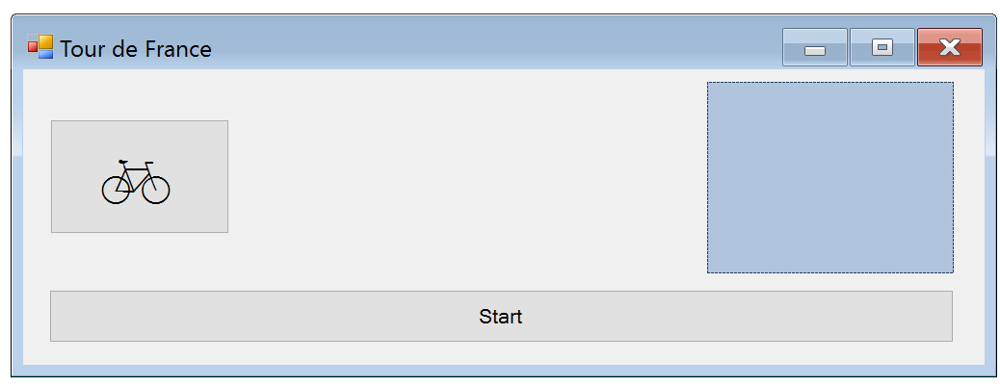
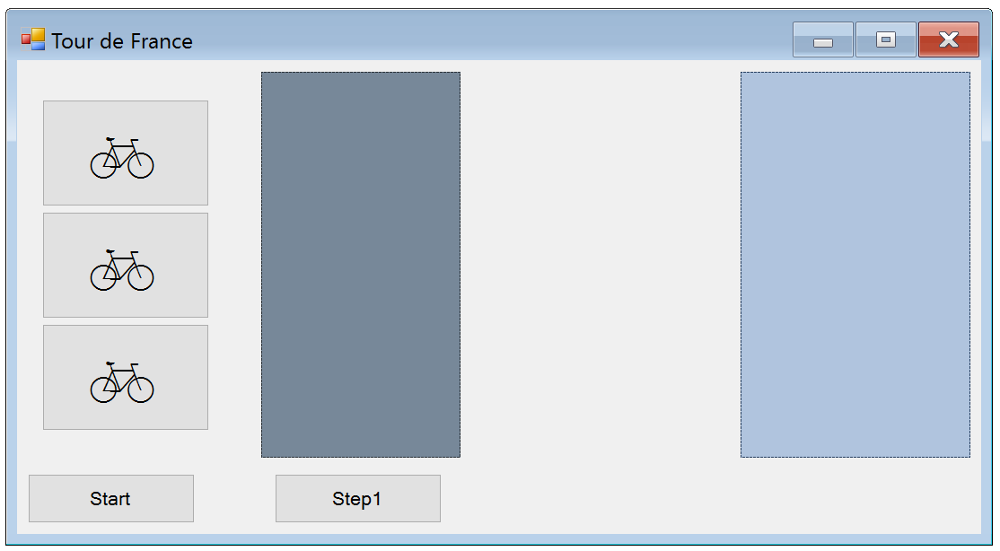
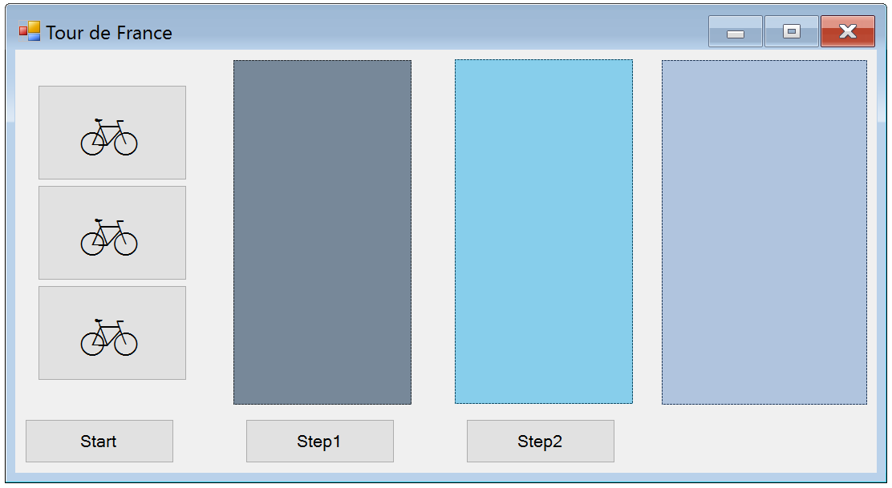

# 4. HF - Többszálú alkalmazások fejlesztése

## Bevezetés

Az önálló feladat a konkurens/többszálú alkalmazások fejlesztése előadásokon elhangzottakra épít. A feladatok gyakorlati hátteréül a [4. labor – Többszálú alkalmazások fejlesztése](../../labor/4-tobbszalu/index.md) laborgyakorlat szolgál.

A fentiekre építve, jelen önálló gyakorlat feladatai a feladatleírást követő rövidebb iránymutatás segítségével elvégezhetők.
Az önálló gyakorlat a következő ismeretek elmélyítését célozza:

- Szálak indítása és leállítása, szálfüggvény
- Munkaszálakból windows-os vezérlők manipulálása
- Kölcsönös kizárás megvalósítása (`lock` használata)
- Jelzés és jelzésre várakozás (`ManualResetEvent`, `AutoResetEvent`)
- Windows Forms tervező használata

A szükséges fejlesztőkörnyezet a szokásos, [itt](../fejlesztokornyezet/index.md) található leírás.

!!! warning "Ellenőrző futtatása"
    Ehhez a feladathoz érdemi előellenőrző nem tartozik: minden push után lefut ugyan, de csak a Neptun.txt kitöltöttségét ellenőrzi és azt, van-e fordítási hiba. Az érdemi ellenőrzést a határidő lejárta után a laborvezetők teszik majd meg.

## A beadás menete

- Az alapfolyamat megegyezik a korábbiakkal. GitHub Classroom segítségével hozz létre magadnak egy repository-t. A meghívó URL-t Moodle-ben találod (a tárgy nyitóoldalán a "*GitHub classroom hivatkozások a házi feladatokhoz*" hivatkozásra kattintva megjelenő oldalon látható). Fontos, hogy a megfelelő, ezen házi feladathoz tartozó meghívó URL-t használd (minden házi feladathoz más URL tartozik). Klónozd le az így elkészült repository-t. Ez tartalmazni fogja a megoldás elvárt szerkezetét. A feladatok elkészítése után commit-old és push-old a megoldásod.
- A kiklónozott fájlok között a `MultiThreadedApp.sln`-t megnyitva kell dolgozni.
- :exclamation: A feladatok kérik, hogy készíts **képernyőképet** a megoldás egy-egy részéről, mert ezzel bizonyítod, hogy a megoldásod saját magad készítetted. **A képernyőképek elvárt tartalmát a feladat minden esetben pontosan megnevezi.** A képernyőképeket a megoldás részeként kell beadni, a repository-d gyökérmappájába tedd (a Neptun.txt mellé). A képernyőképek így felkerülnek GitHub-ra git repository tartalmával együtt. Mivel a repository privát, azt az oktatókon kívül más nem látja. Amennyiben olyan tartalom kerül a képernyőképre, amit nem szeretnél feltölteni, kitakarhatod a képről.
- :exclamation: A beadott megoldások mellé külön indoklást, illetve leírást nem várunk el, ugyanakkor az elfogadás feltétele, hogy a beadott kódban a feladat megoldása szempontjából relevánsabb részek **kommentekkel legyenek ellátva**.

## Feladat 1 – Bicikli

### Bevezető feladatok

1. :exclamation: A főablak fejléce a "Tour de France" szöveg legyen, hozzáfűzve a saját Neptun kódod: (pl. "ABCDEF" Neptun kód esetén "Tour de France - ABCDEF"), fontos, hogy ez legyen a szöveg! Ehhez az űrlapunk `Text` tulajdonságát állítsuk be erre a szövegre.

### Feladat

A Windows Forms alkalmazásunk főablakának bal oldalán egy gomb legyen (ez egy biciklit jelképez), a jobb oldalán egy kék színű panel (ez a célt jelképezi), továbbá legyen egy "start" feliratú gomb a felület alján. A gomb megnyomásakor indítsunk egy új háttérszálat, mely a biciklit jelképező gombot ==**2**== és ==**8**== közötti (véletlenszerűen választott) lépésközönként átmozgatja a jobb oldalon található panelig!

### Megoldás

1. Adjunk az alkalmazás főablakához (ebben a sorrendben) egy panel és két gomb vezérlőt az alábbi tulajdonságokkal:
    - `Panel`
        - `Name`: `pTarget`
        - `BackColor`: `LightSteelBlue`
    - `Button`
        - `Name`: `bBike1`
        - `Text`: `b`
        - `Font.Name`: `Webdings`
        - `Font.Size`: `32`
    - `Button`
        - `Name`: `bStart`
        - `Text`: `Start`

2. Rendezzük be a vezérlőket a következőképpen:

    

3. A bicikli mozgatására definiáljuk az alábbi segédfüggvényeket

    ```csharp
    public void BikeThreadFunction(object param)
    {
        var bike = (Button)param;
        while (bike.Left < pTarget.Left)
        {
            MoveBike(bike);
            Thread.Sleep(100);
        }
    }
    
    Random random = new Random();

    public void MoveBike(Button bike)
    { 
        if (InvokeRequired)
        {
            Invoke(MoveBike, bike);
        }
        else
        {
            bike.Left += random.Next(2, 8);
        }
    }
    ```

    !!! tip "Emlékeztető"
        **Egy Windows Forms vezérlőhöz/űrlaphoz csak abból a szálból lehet hozzáférni, mely a vezérlőt létrehozta, ugyanis ezek nem szálbiztosak, és kivétel dobásával jelzik, ha mégis „rosszul” próbáljuk őket használni.** A probléma elkerülésére az **`InvokeRequired`/`Invoke`** használata nyújt megoldást.

4. Iratkozzunk fel a Start gomb eseménykezelőjére (duplaklikk a Start gombra a designerben), majd teszteljük az alkalmazást.

    ```csharp
    private void bStart_Click(object sender, EventArgs e)
    {
        StartBike(bBike1);
    }

    private void StartBike(Button bBike)
    {
        var t = new Thread(BikeThreadFunction)
        {
            IsBackground = true, // Ne blokkolja a szál a processz megszűnését
        };

        bBike.Tag = t;
        t.Start(bBike);
    }
    ```

    A fenti felület tulajdonképpeni célja, hogy szálak futását és szinkronizációját (Windows Forms űrlapok/vezérlők vonatkozásában) demonstrálja. A későbbi, immár önállóan megvalósítandó feladatokban további szálakat (és bicikliket) fogunk létrehozni, és a futásukat összehangolni.

    !!! tip "Előrehozás"
        Ha a jelen vagy egy későbbi feladatban a biciklit reprezentáló gomb nem a panel előtt, hanem mögötte jelenik meg, akkor jobb gombbal kattintsunk a panelen, és válasszuk ki a *Send to back* menüt.

    ??? tip "Bezáráskori ObjectDisposedException"  
        Ha a megoldásunkat Visual Studioban debuggolva futtatjuk, akkor kilépéskor `ObjectDisposedException`-t kaphatunk. Az `Invoke` csak akkor hívható, amikor a űrlapunk mögötti natív ablak még létezik. Kilépéskor ez megszűnik, ebből ered a "hiba". Ez inkább csak egyfajta figyelmeztetés a keretrendszer részéről, de esetünkben nem igazi hiba: ha nem debuggolva indítjuk az alkalmazást, akkor kilépéskor nem is jelentkezik, lenyelődik. Szép, de kicsit körülményesebb megoldás lehetne, ha pl. a `Form` `OnClosing` függvényét felüldefiniálva vagy a `FormClosing` eseménykezelőben leállítanánk a szálakat (vagy egy flag-gel jeleznénk feléjük, hogy most már nem szabad `Invoke`-ot hívni). Kevésbé szép megoldás lehet az `ObjectDisposedException` elkapása és lenyelése.

!!! example "BEADANDÓ"
    Mielőtt továbbmennél a következő feladatra, egy képernyőmentést kell készítened.

    Készíts egy képernyőmentést `Feladat1.png` néven az alábbiak szerint:

    - Indítsd el az alkalmazást. Ha szükséges, méretezd át kisebbre, hogy ne foglaljon sok helyet a képernyőn,
    - a „háttérben” a Visual Studio legyen, a `MainForm.cs` megnyitva,
    - a VS *View/Full Screen* menüjével kapcsolj ideiglenesen *Full Screen* nézetre, hogy a zavaró panelek ne vegyenek el semmi helyet,
    - VS-ben zoomolj úgy, hogy a fájl teljes tartalma látható legyen, az előtérben pedig az alkalmazásod ablaka.

## Feladat 2 – Rajtvonal

### Feladat

Valósítsuk meg a rajtvonalat. Egészítsük ki az alkalmazásunkat két további biciklivel, melyek mozgatásáért két további szál fog felelni, illetve egy új panellal (*start panel*) és egy gombbal (*Step1*) a következő elrendezésben:



A *Start* gomb megnyomását követően mindhárom bicikli induljon el véletlenszerű tempóban. Amikor egy bicikli a start panelre érkezik, az őt vezérlő szál blokkolva várakozzon. Amikor a *Step1* gombot megnyomjuk, a biciklik folytassák útjukat a célig.
Ha a felhasználó azelőtt nyomja meg a Step1 gombot, hogy a biciklik elérnék a startvonalat, akkor a bicikliknek már nem kell megállni a startvonalon (de az is teljesen jó megoldás, ha ilyen esetben a Step1 lenyomását még figyelmen kívül hagyja az alkalmazás).

### Megoldás

A feladat megoldásához a kapcsolódó gyakorlatban már alkalmazott, illetve az itt korábban megismert elemeket kell alkalmazni és kombinálni. A megoldás lépéseit csak nagy vonalakban adjuk meg, némi kiegészítő segítséggel:

- Mivel a start-panelt a biciklinél később helyeztük a `Form`-ra, alapesetben kitakarja a fölé menő biciklit. Ezen úgy segíthetünk, hogy a tervező nézetben a panelon jobb egérgombbal kattintva kiadjuk a *Send to back* parancsot.
- Az egyszerűbb átláthatóság érdekében fontos, hogy az újabb vezérlőknek is mind beszédes neveket adjunk (pl.: `bBike2`, `bBike3`, `bStep1`)
- Mivel a várakozást követően a versenyzőknek egyszerre kell indulniuk, a várakozás és indítás megvalósítására egy `ManualResetEvent` objektumot célszerű használni.
- A feladat megoldása során gombonként egy szálfüggvényt kell használni, vagyis a *Step1* gomb megnyomásakor ne új szálakat indítsunk minden gombhoz, hanem meg kell oldani, hogy meglévő szálak várakozzanak, majd a gombnyomást követően folytassák futásukat.

## Feladat 3 – Pihenő

### Feladat

Egészítsük ki az alkalmazásunkat egy további panellal (depo panel), mely egy pihenőt jelképez. A pihenőhelyre beérkezve a biciklik megállnak, majd egyesével tovább indulnak. A továbbindításért egy új gomb (*Step2*) felel, melynek minden gombnyomására egy-egy bicikli elindul. A pihenő alatt a bicikliket mozgató szálak blokkolva várakozzanak.



### Megoldás

A feladat megoldása analóg az előzőével, ám ezúttal `AutoResetEvent`-et kell használni.

!!! example "BEADANDÓ"
    Mielőtt továbbmennél a következő feladatra, egy képernyőmentést kell készítened.

    Készíts egy képernyőmentést `Feladat3.png` néven az alábbiak szerint:

    - Indítsd el az alkalmazást. Ha szükséges, méretezd át kisebbre, hogy ne foglaljon sok helyet a képernyőn,
    - a „háttérben” a Visual Studio legyen, a `MainForm.cs` megnyitva,
    - a VS *View/Full Screen* menüjével kapcsolj ideiglenesen *Full Screen* nézetre, hogy a zavaró panelek ne vegyenek el semmi helyet,
    - görgess le a forrásfájlod legaljára, használj kb. normál zoom vagy kicsit kisebb értéket, fontos, hogy ami a képernyődön lesz, legyen jól olvasható (az nem baj, ha nem fér ki minden), az előtérben pedig az alkalmazásod ablaka.

## Feladat 4 – Kilométeróra

### Feladat

Egészítsük ki a `Form`-ot egy `long` típusú mezővel. Minden egyes bicikli minden megtett lépése után növeljük meg ezt a számlálót a lépés során megtett pixelek számával. A cél-panel alatt legyen egy gomb, melyet megnyomva a gomb szövege a számláló aktuális értékére változzon. Ügyeljünk a kölcsönös kizárásra, melyet `lock` utasítás segítségével valósítsunk meg.

### Megoldás

A megoldás menete:

- Készíts egy új függvényt, amely a megtett utat számláló változót megnöveli a paraméterben kapott pixel számmal (`void IncreasePixels(long step)`). Ügyelj arra, hogy ezt a függvényt bárhonnan, bármely szálból lehessen hívni.
- Készíts egy másik függvényt, amellyel biztonságosan kiolvasható az aktuális számláló értéke, bármilyen szálból is hívják (`long GetPixels()`).
- A biciklik mozgatásakor hívd meg a lépést hozzáadó `IncreasePixels` függvényt.
- A célpanel alatt levő gomb kattintásakor kérdezd le az aktuális számláló értéket a `GetPixels` függvénnyel, és írd ki a gombra az értéket.

!!! warning "Lényeges"
    A megoldás csak akkor elfogadható, ha a `lock` utasítással a kölcsönös kizárás megvalósításra kerül (`IncreasePixels` és `GetPixels` függvények).

!!! example "BEADANDÓ"
    Mielőtt továbbmennél a következő feladatra, egy képernyőmentést kell készítened.

    Készíts egy képernyőmentést `Feladat4.png` néven az alábbiak szerint:

    - Indítsd el az alkalmazást. Ha szükséges, méretezd át kisebbre, hogy ne foglaljon sok helyet a képernyőn,
    - a „háttérben” a Visual Studio legyen, a `MainForm.cs` megnyitva,
    - a VS *View/Full Screen* menüjével kapcsolj ideiglenesen *Full Screen* nézetre, hogy a zavaró panelek ne vegyenek el semmi helyet,
    - görgess le a forrásfájlod legaljára, használj kb. normál zoom vagy kicsit kisebb értéket, fontos, hogy ami a képernyődön lesz, legyen jól olvasható (az nem baj, ha nem fér ki minden), az előtérben pedig az alkalmazásod ablaka.

## Feladat 5 – Újrakezdés

### Feladat

Egészítsük ki az alkalmazásunkat úgy, hogy bármelyik biciklit újra tudjuk indítani. Az újra indításhoz elég a biciklit jelképező gombra kattintani. Ilyenkor a bicikli visszakerül a kiinduló pozícióba, és újra kezdi a futamot (az újrakezdéshez nem kell a Start gombot megnyomni, a Start gombot célszerű is az első kattintás során letiltani, hogy csak egyszer lehessen kattintani rajta). Az új futam során a bicikli *Step2*-nél ismét meg kell álljon (a *Step1* kapcsán szabadon lehet választani).

### Megoldás

A következőkben megadjuk a feladat megoldásának néhány fontos elemét.

A feladat megoldásához meg kell tudnunk szakítani az aktuálisan futó szálat, legalábbis `WaitSleepJoin` állapotban (`Thread.Interrupt` művelettel). Ehhez minden egyes gombhoz tárolnunk kell az aktuálisan őt vezérlő szál objektumot. Ezt (hasonlóan a [3. gyakorlat 3. feladatához](../../labor/3-felhasznaloi-felulet/index.md#miniexplorer-logika)) megtehetjük a vezérlő `Tag` tulajdonságában. A `Tag` tulajdonság beállítására vagy a szál létrehozása után a `StartBike` műveletben, vagy a szálfüggvényben (az aktuális szál `Thread.CurrentThread`-del való lekérdezésével) kerítsünk sort. Példa az utóbbira:

```csharp hl_lines="4"
public void BikeThreadFunction(object param)
{
    Button bike = (Button)param;
    bike.Tag = Thread.CurrentThread;
    // ...
}
```

Ezt az információt a későbbiekben kiolvashatjuk a gombnyomás eseménykezelőjében:

```csharp
private void bike_Click(object sender, EventArgs e)
{
    Button bike = (Button)sender;
    Thread thread = (Thread)bike.Tag;
    
    // Ha még nem indítottuk ez a szálat, ez null.
    if (thread == null)
        return;

    // Megszakítjuk a szál várakozását,
    // ez az adott szálban egy ThreadInterruptedException-t fog kiváltani
    // A függvény leírásáról részleteket az előadás anyagaiban találsz
    thread.Interrupt();

    // Megvárjuk, amíg a szál leáll
    thread.Join();
    
    // ...
}
```

Érdemes észrevenni, hogy a gomb eseménykezelőjében a `sender` paraméterből kiolvasható, hogy konkrétan melyik gombtól származik az esemény. Ezt kihasználva nem szükséges mindhárom gombhoz külön eseménykezelő függvényt írnunk, hanem használhatja mindhárom gomb ugyanazt a függvényt. Egy eseményhez a következőképpen tudunk Visual Studioban egy már létező függvényt hozzárendelni: a *Properties* ablak események oldalán ne duplán kattintsunk az eseményen, hanem kattintsunk egyszer az esemény során, majd nyissuk le az esemény sorában a jobboldali oszlopman megjelenő legördülőmezőt, és válasszuk ki a listából a megfelelő függvényt.

A `thread.Interrupt()` hívás a `BikeThreadFunction` függvényen belül egy `ThreadInterruptedException` kivételt fog kiváltani (amikor a szál `WaitSleepJoin` állapotba kerül, vagyis a `Sleep` és `WaitOne` művelethívások során). Fontos, hogy a kivételre fel legyünk készülve, vagyis a függvény teljes törzse `try-catch` blokkal számítson az ilyen típusú kivételre. Például így:

```csharp
try
{
    // Teljes függvénytörzs
    // ...
}
catch (ThreadInterruptedException)
{ 
    // Lenyeljük, de szigorúan kizárólag a ThreadInterruptedException-t.
    // Ha nem kezelnénk az Interrupt hatására a szállfüggvényünk
    // és az alkalmazásunk is csúnyán "elszállna".
}
```

A feladat további megoldása önállóan elvégezhető a korábbi ismeretek alapján.

## Opcionális feladat – 2 IMsc pontért

### Feladat

Tegyük lehetővé a biciklik megállítását. Tegyünk ki egy új gombot a *Start* gomb alá *Stop* felirattal. A *Stop* gombra kattintás állítsa meg az összes biciklit, és állítsa le a bicikliket futtató szálakat is.

### Megoldás

A következőkben megadjuk a feladat megoldásának néhány fontos elemét:

- Tegyél fel egy *Stop* gombot a felületre és készítsd elő a kattintást kezelő függvényt.
- A megállításhoz szükség lesz két jelzésre a bicikliket futtató szál felé. Ez egyik jelzés egy `bool` típusú változó, amelyet a bicikliket futtató szál ciklusa figyel. Vedd fel ezt `stopBikes` néven, és módosítsd a szálfüggvényt, hogy ha a `bool` változó jelez, fejezze be a futást.
- A másik jelzés abban az esetben kell, ha a szálak várakoznak. Ilyenkor nem tudják a `bool` változót ellenőrizni. Vegyél fel egy új `ManualResetEvent` típusú változót, amely a leállítás eseményt fogja jelezni. Ezt az eseményt a `bool` változóval együtt a *Stop* gombra való kattintás eseménykezelőjében kell jelzettbe állítani.
- A bicikliket mozgató szálfüggvényben kommentezd ki (ne töröld!) az eddigi várakozást megvalósító kódrészeket, és készíts egy új megoldást az előbb felvett leállítást jelző `ManualResetEvent` segítségével. A várakozásokra továbbra is szükség lesz, azonban várakozni nem csak a start vonalra illetve a pihenőre szükséges, hanem a leállítást is észre kell venni.
- Ha leállítás történt, a szál futását be kell fejezni. Ha a leállást jelző esemény megtörtént, térjen vissza a szál függvénye egy `return` utasítással.